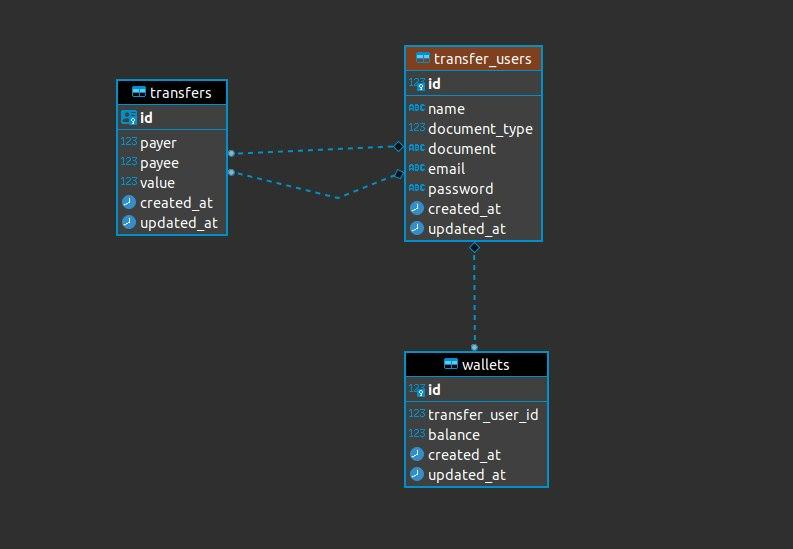

#  Transfer Flow
## Transfer Flow is a simple flow of transfer between users
 

## Configuring and running
    `cp env.example .env`
    `docker-compose up -d`

## Running migrations
    `php artisan migrate`
### To clear database and run all
    `php artisan migrate:fresh`

## Running Seeders
    `php artisan db:seed`
    
## Starting queue to listen
    `php artisan queue:listen`

## Running tests
    `php artisan test --filter Transfer`

## Stopping containers
    `docker-compose down`

## DER for api

  

## Endpoint for api
- This endpoint is based on the default configurations inside the env-example
`http://localhost:8081/api/transfer/`